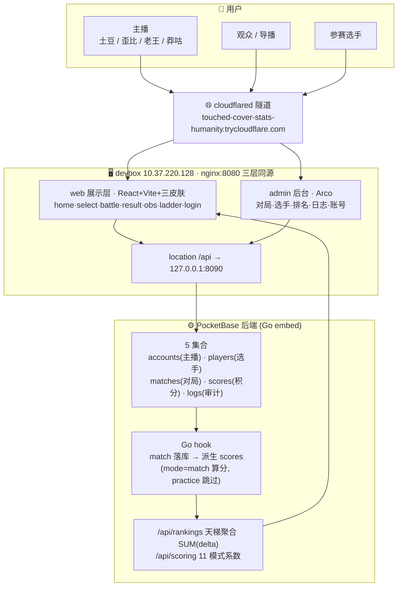
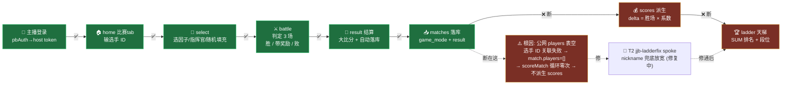
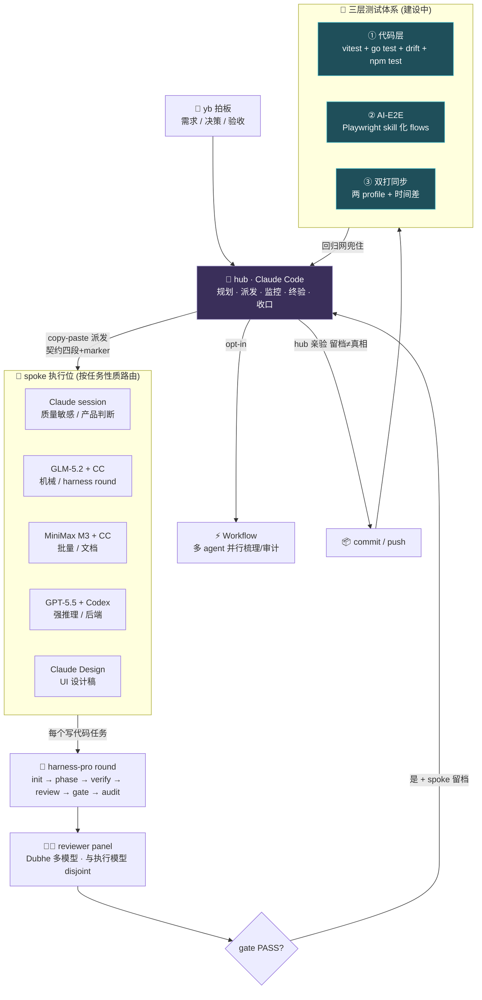

# 集结杯 · 体系运作图（SYSTEM MAPS）

> repo 内 Mermaid 版（进 git、可 diff、随代码演进）。团队可读版在飞书 KB 画板。
> 三张图回答三个问题：**这套系统由什么组成 / 一局比赛怎么流动 / 我们怎么开发它**。
> 维护：架构/流程变更时同步改本文件 + 飞书画板。最后更新 2026-06-24。

---

## 图 1 · 系统架构（系统由什么组成）

---

## 图 2 · 比赛流程（一局怎么流动 · 标出哪通哪断）

> 单刷/双打 UI 全流程 works，单刷能落一条真 match；**天梯恒空是头号产品阻塞**（非 UI bug，是 players 表空的数据断点），T2 spoke 用 nickname 兜底修复中。双打「两主播同步判定合流」架构上不存在，是 T8 探测对象。

---

## 图 3 · 开发体系（我们怎么开发它 · hub→spoke 编排）

> **当前在建**：三层测试体系（T1 GLM-5.2 起跑中）。**当前并行 lane**：T1 测试(GLM-5.2) · T2 修天梯(Claude) · T3 文档(MiniMax) · T4 本图(hub)。
