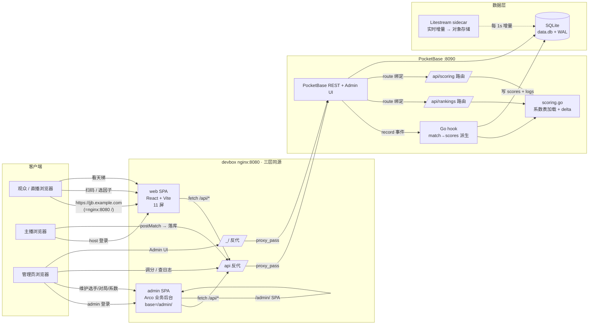
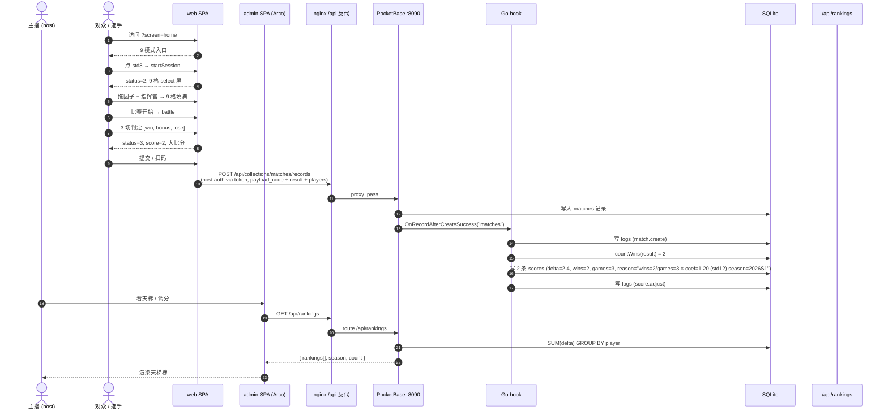

# 集结杯 · 架构（Architecture）

> 范围：项目从「单刷抽签工具」演进到「比赛平台」后的完整体系图：11 屏前端 + Arco 业务后台 + PocketBase 7 集合后端 + devbox 三层同源部署。
> 真相源：`projectplan.md`（决策史）/ `web/src/`（前端代码）/ `backend/`（PocketBase + Go hook）/ `backend/deploy/`（部署产物）。

---

## 0. 一张图看清



---

## 1. 前端：9 + 2 屏（`web/src/screens/`）

| 屏 | 路径 | 路由 (`?screen=`) | 职责 | 关键逻辑 |
|---|---|---|---|---|
| **HomeScreen** | `HomeScreen.tsx` | `home`（默认） | 入口：选 11 模式之一开赛 / 进天梯 / 进码方案 | `setRuleMode('practice'\|'match')` + `startSession(mode)` |
| **SelectScreen** | `SelectScreen.tsx` | `select` | 因子/指挥官拖拽 + BP 规则 + 9 格契约 | `jjbSession.validate / startFromSelection` |
| **BattleScreen** | `BattleScreen.tsx` | `battle` | 3 场 BO3 判定（lose / win / bonus 三态） | `setVerdict` → `winLoseList[i]` |
| **ResultScreen** | `ResultScreen.tsx` | `result` | 大比分 + 战绩卡 + 落库触发 | `getScore()` + `postMatch(payload)` |
| **ObsScreen** | `ObsScreen.tsx` | `obs` | 直播横条三形态 | `ObsBar` 组件，三态 URL 参数切换 |
| **LadderScreen** | `LadderScreen.tsx` | `ladder` | 天梯榜（公开读 `/api/rankings`） | `getRankings()` + 系数展示 |
| **LoginScreen** | `LoginScreen.tsx` | `login` | 双 tab 登录：选手（player_accounts）/ 主播（accounts host·admin） | `pbAuthPlayer` / `pbAuthHost` |
| **RegisterScreen** | `RegisterScreen.tsx` | `register` | 选手注册参赛（昵称/手机号/密码 + 擅长指挥官 22 chip 选填） | `registerPlayer` + `pbAuthPlayer`（注册即登录） |
| **EventRulesScreen** | `EventRulesScreen.tsx` | `eventrules` | 需求2 赛事临时 ban 配置面（主播后台：禁地图/因子/官突） | `event_rules` 读写 + `eventBan.ts` 三引擎 pre-roll |
| **BpConfigScreen** | `BpConfigScreen.tsx` | `bpconfig` | BP 规则配置（practice 无上限 / match 上限 1） | `toggleBanFactor` / `getBpExclusive` |
| **CodeScreen** | `CodeScreen.tsx` | `code` | 码方案（`?code=gen` 生成 / `?code=paste` 贴码还原） | `codec.encodePayload` / `applySnapshot` |

> **9 屏**（home / select / battle / result / obs / ladder / login / register / eventrules）+ **2 子页**（bpconfig / code）。`App.tsx` 集中路由（`?screen=…`）+ 主题切换（`?style=metal|sc2|minimal` × `?mode=dark|light`）。登录门（需求1）：select/battle 开局前要登录，公开读屏（home/obs/ladder/result/eventrules/code）匿名不挡。

### 1.1 视觉主题（6 主题 token）

`web/src/styles/` 实现 3 风格 × 2 模式 = **6 主题**（metal·dark / metal·light / sc2·dark / sc2·light / minimal·dark / minimal·light）。设计真相源在 `design/v4-r2/`（Claude Design 出稿），CSS 编译期 glob 引入对应 token。

### 1.2 核心逻辑模块（`web/src/logic/`）

| 模块 | 职责 | 关键导出 |
|---|---|---|
| `jjbSession.ts` | 单打状态机 + 9 模式开局 + BP + 难度分 | `startSession / getSelectState / validate / startFromSelection / getSessionMatches / factorScore / difficultyTotal` |
| `jjbDoubles.ts` | 双打独立引擎（自管 selection + winLose） | `getDoublesState / setDoublesCmd / setDoublesFac / setDoublesVerdict / randomFillDoubles / doublesScore` |
| `codec.ts` | 整局 → 自包含短码（schema v1 冻结） | `encodePayload / decodePayload` + 三道闸（version / pool / invalid） |
| `backend.ts` | PocketBase API 客户端（双登录 / 注册 / match / rankings） | `pbAuthPlayer / pbAuthHost / registerPlayer / getAccount / pbRefresh / postMatch / getPlayerByCode / getRankings` |
| `eventBan.ts`（需求2） | 赛事临时 ban 状态机（地图/因子/官突三引擎 pre-roll） | `loadEventBan / getBanMaps / getBanFactors / getBanMutators / fetchAndLoadEventBan` |
| `bpConfig.ts` | BP 规则 + practice/match 软违规分流 | `toggleBanFactor / getBpState / getBpExclusive` |
| `aiEnemySelector.ts` | 随机敌方（开关 ON 注入 P/T/Z） | `rollEnemy / getEnemyPool` |
| `commanderWeight.ts` | 指挥官权重（A/B 组） | `getCommanderPool` |
| `randomConfig.ts` | 因子 / 地图 / 难度预算 | `getRandomFactorPoor` |
| `jjbView.ts` | 视图层只读聚合（不下指令） | `currentSessionMode / currentTotal` |

---

## 2. 后端：7 集合 + Go hook + 2 自定义路由（`backend/`）

### 2.1 7 集合 schema（`pb_migrations/`：init_collections + scores_wins_games + event_rules + player_accounts）

| 集合 | 类型 | 关键字段 | 读 | 写 |
|---|---|---|---|---|
| **accounts** | auth | `email / password / role (admin\|host\|viewer) / display_name` | admin-only | admin-only（update 可改自己） |
| **players** | base | `nickname / player_code (unique) / race_pref (t\|z\|p) / avatar / active` | 公开 | host ‖ admin |
| **matches** | base | `mode (practice\|match) / game_mode (11 SessionMode 枚举) / payload_code / payload_ver / players (relation) / host (relation) / result (JSON winLoseList) / score_total / bp_config` | 公开 | host ‖ admin（改：本人主持 ‖ admin） |
| **scores** | base | `player (relation) / match (relation) / delta / wins / games / reason / season` | 公开 | admin-only（hook 用 `app.Save` 绕过规则写） |
| **logs** | base | `actor (relation accounts) / action / target_type / target_id / detail (JSON) / ip` | admin-only | hook 写；update/delete = nil 不可改删 |
| **event_rules**（需求2） | base | `season / ban_maps / ban_factors / ban_mutators (JSON) / active` | 公开（`/api/event-rules` active=true） | host ‖ admin（单活跃 hook：存 active 时其它行置 false + 写 logs） |
| **player_accounts**（需求1） | auth | `nickname / phone / social (JSON) / fav_commanders (JSON 中文名数组) / player (relation→players)` | 自隔离（list/view/update = `@request.auth.id=id`） | 自助注册（create=`""`）/ delete = admin |

> 5 个 Go embed 迁移（`..001_init_collections` / `..002_lock_default_users` / `..003_scores_wins_games` / `..004_event_rules`〔需求2〕 / `..005_player_accounts`〔需求1〕） + PocketBase 内置 `users` 锁。

### 2.2 算分 hook（`backend/hooks.go`）

```
match 落库（POST /api/collections/matches/records）
  │
  ▼
OnRecordAfterCreateSuccess("matches")
  │
  ├── 审计：写 logs（match.create，所有 mode 都写）
  │
  ├── mode == "practice" → return（不派生 scores；开放问题拍板：练习默认不落库不计分）
  │
  └── mode == "match"
       ├── 解析 result 字段（marshal→unmarshal 兼容 []any / []byte / string / types.JsonRaw）
       ├── countWins(result)：v==1 (win) || v==2 (bonus) 计数
       ├── calcDelta(game_mode, wins) = wins × coefFor(game_mode)
       │                          系数查 config/scoring.json，未知 game_mode → default_coefficient
       │                          赛季 current_season = currentSeason() 兜底 "default"
       ├── 为每个 player 写一条 scores（player / match / delta / wins / games / reason / season）
       └── 审计：写 logs（score.adjust，detail 含 wins/coef/delta/season/game_mode/player_ids）
```

> 关键性质：算分**不依赖前端传的 `score_total`**（防伪造），从 `result` 复算；scores 由 hook 用 `app.Save` 绕过 API rules 写，前端不直接 POST。

### 2.3 天梯聚合（`backend/routes.go`）

```
GET /api/rankings?season=<可选>
  │
  ├── 默认 season = currentSeason()（"2026S1"）
  ├── SQL 聚合：
  │     SELECT p.id, p.nickname, p.player_code, p.race_pref,
  │            COALESCE(SUM(s.delta), 0)  AS total_delta,
  │            COALESCE(SUM(s.wins),  0)  AS total_wins,
  │            COALESCE(SUM(s.games), 0)  AS total_games,
  │            COUNT(s.id)               AS match_count
  │     FROM players p
  │     LEFT JOIN scores s ON s.player = p.id AND s.season = :season
  │     WHERE p.active = 1
  │     GROUP BY p.id
  │     ORDER BY total_delta DESC, p.nickname ASC
  │
  └── 返 { season, count, rankings[] }，公开读（无 auth）
```

**为什么用 LEFT JOIN**：未参赛选手也会出现（0 分 0 胜 0 总），不漏成员。

### 2.4 系数读取（`backend/routes.go`）

```
GET /api/scoring
  │
  └── 返 { current_season, coefficients, default_coefficient, formula }
       公开读，ladder 屏显计分规则用
```

**系数配置化**：`backend/config/scoring.json` 启动加载到全局（`scoring.go`），改 JSON 重启即生效，**不重编译 Go**。

### 2.5 当前系数表（`config/scoring.json`，2026-06-24 拍板前最简值）

| game_mode | 系数 | 含义 |
|---|---|---|
| `std8` / `std10` / `std12` | 1.0 / 1.1 / 1.2 | 标准 8/10/12 因子 |
| `rescue` | 1.3 | 拯救（难度加成） |
| `one-a` | 1.1 | 指挥官一选一 |
| `hard1` / `hard2` | 1.3 / 1.3 | 极难 |
| `feiqiu` / `suiji` | 1.0 / 1.0 | 非酋 / 完全随机 |
| `doubles` / `feiqiu-doubles` | 1.0 / 1.0 | 双打 + 非酋双打 |
| **default_coefficient** | 1.0 | 未知 game_mode 兜底 |

> **caveat 3**：真实系数（点金 ×2 / 连胜加成 / 赛季周期）须 yb/土豆拍板定稿；改 JSON 重启即生效，**不动 schema**。

---

## 3. 数据流：登录 → 选因子 → 判定 → 录入 → 算分 → 天梯



### 3.1 关键接缝

| 接缝 | 落点 | 说明 |
|---|---|---|
| **session 状态机** | `JijieData` (web 端 TS 单例) + `JJBDoubles` (双打独立闭包) | 前端单刷/双打分流：startSession('doubles') 早分支启动双打引擎，**不碰 JijieData**（difficultyTotal 隔离断言见 `e2e/run.mjs` 段 3 ④ phase3） |
| **payload_code** | `codec.ts` schema v1 | 整局 → 自包含短码，max 2048 字符（实测 ≤858 + 余量）；`matches.payload_code` 单字段存整局，max 长度对齐 codec 上限 |
| **winLoseList** | `web/src/logic/jjbSession.ts` + `result` JSON 字段 | `RESULT_VAL = { lose: 0, win: 1, bonus: 2 }`，hook `countWins` 算 v∈{1,2} 计数对齐 `getScore()`（win+bonus 不双计） |
| **天梯聚合键** | `scores.season` (从 `current_season` 来) | `season=2026S1`（待定稿）；改 `config/scoring.json` 的 `current_season` 即可切赛季，旧 score 仍可按历史 season 聚合（见 `?season=` 参数） |

---

## 4. 部署拓扑（`backend/deploy/`）

| 层 | 形态 | 端口 | 职责 | 部署产物 |
|---|---|---|---|---|
| **nginx** | docker `jijiebei-nginx` (`nginx:1.27-alpine`) | 宿主 8080:80 | web 静态 / admin 静态 / `/api` 反代 / `/_/` Admin UI 反代 | `backend/deploy/nginx-docker-triple.conf` |
| **web** | Vite SPA，hash 文件名（CDN 友好） | 容器内 80 | 11 屏 + 6 主题 | `web/dist/`（`npm run build`） |
| **admin** | Vite SPA (`base=/admin/`) | 容器内 80 | Arco 业务后台（6 模块：Dashboard / Players / Matches / Accounts / Rankings / Logs） | `admin/dist/`（`npm run build`） |
| **backend** | PocketBase 单二进制 + Litestream sidecar | 宿主 127.0.0.1:8090（不直接对外） | 7 集合 + Go hook + 2 自定义路由 | `backend/pocketbase`（`go build`）+ `config/` + `pb_migrations/`（编译进二进制） |
| **数据** | SQLite + Litestream → S3 兼容对象存储 | — | 实时增量复制（`sync-interval: 1s`） | `backend/deploy/litestream.yml` |

> **三者同源** = 前端 `fetch /api` 走同一 origin 8080，**免 CORS**。详细部署步骤见 [docs/deployment.md](deployment.md)。

### 4.1 后台 admin 5 模块

`admin/src/pages/` 实现 6 页面（Dashboard + 5 业务模块）：

| 页面 | 路径 | 职责 |
|---|---|---|
| Dashboard | `Dashboard.tsx` | 概览：赛季 / 选手数 / 对局数 / 最近录入 |
| Players | `Players.tsx` | 选手 CRUD（按 player_code 锚定，nickname 可改） |
| Matches | `Matches.tsx` | 对局列表 + 录入 + 调分入口 |
| Accounts | `Accounts.tsx` | 主播账号管理（admin-only） |
| Rankings | `Rankings.tsx` | 天梯查看 + 系数展示（公开） |
| Logs | `Logs.tsx` | 审计日志（admin-only，不可改删） |

---

## 5. 关键契约 & 不变量

1. **9 格契约**：`selectedFactorList.length === 9`（每场 1 锁定 + N 手选，3 场共 9 格；e2e/run.mjs 段 2 Phase 1 强制）。
2. **池=槽恒等式**：`randomFactorPoor.length === Σ manualSlots`（`modeFlags` 决定每场几格手选；`modeSuiji=[0,0,0]` / `modeFeiqiu=[1,1,1]` / 其它按 `modelFactorCount` 推算）。
3. **mode 分流**：`mode=='match'` 派生 scores；`mode=='practice'` 不派生（练习默认不计分）。
4. **wins/games 战绩**：`scores.wins = countWins(result)`，`scores.games = len(result)`；`/api/rankings` 用 `COALESCE(SUM(wins),0)` / `COALESCE(SUM(games),0)` 兜底 0（旧记录 nil 字段不报错）。
5. **logs 不可改删**：`updateRule = nil` + `deleteRule = nil` → PocketBase 返 403 `Only superusers can perform this action`（验证见 `verify-all.sh` §6e）。
6. **payload_code schema v1 冻结**：`codec.ts` 三道闸（version / pool / invalid）保证编解码往返等价（`e2e/codec.mjs` 段 2 强制）。
7. **0 改 jijie2 / jjbDesign 边界**：前端逻辑引擎 `assets/Script/jijie2/` XP 维护；jjbDesign / web/src 只读 `JijieData` public + 调 XP 现成 handler。
8. **season 隔离**：scores.season 决定天梯聚合键；`?season=` 可查历史赛季；改 `config/scoring.json` 的 `current_season` 即切赛季。

---

## 6. 入口与切换矩阵

| 想做什么 | 命令 / URL |
|---|---|
| 本地起前端 | `cd web && npm run dev` → http://localhost:7788/ |
| 本地起后端 | `cd backend && ./pocketbase serve --http 127.0.0.1:8090` |
| 看 Admin UI | http://127.0.0.1:8090/_/ |
| 看天梯（前端） | http://localhost:7788/?screen=ladder |
| 看直播横条 | http://localhost:7788/?screen=obs&style=sc2&mode=dark |
| 切 6 主题 | `?style=metal\|sc2\|minimal` + `?mode=dark\|light` |
| 看码方案 | http://localhost:7788/?screen=code&code=gen |
| 后台本地 | `cd admin && npm run dev` → http://localhost:7790/ |
| 验证后端 | `cd backend && ./verify-all.sh`（前提 PB 在 8090 跑） |
| 跑端到端 e2e | `cd web && npm run build && node e2e/run.mjs`（其它 7 个 e2e 同 node 命令） |

---

## 7. 已知 caveat（架构层 · 待 hub/yb 拍板）

1. **CF Pages 跨域 vs devbox nginx 同源**：devbox 仅内网 8080；公网走 CF Pages 必须经 SRE / TLB 正规流程（见 `jjb-public-deploy-policy`）。
2. **payload_code 编码器归属**：已用 P3 codec（web 端纯函数 `codec.ts`），后端只定字段 + max 2048 长度。
3. **积分难度系数表未定稿**：当前最简纯累加，**天梯上线前必须定稿**（caveat 3）。
4. **admin 物理隔离**：admin/ 是独立子应用，build base=/admin/，与 web 物理隔离（不同目录、不同 build、不同路由前缀），三者仅共享同源 /api。
5. **0 改 jijie2 边界**：跨引擎修改走 XP 维护方；jjbDesign / web 0 工作改动。
